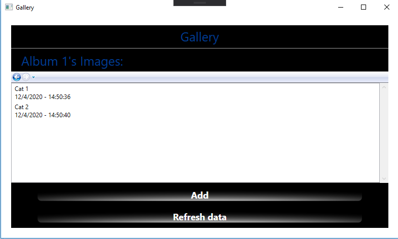

# Ariel Adjadj's Gallery Project:

## Explanation

Bonus for Magshimim's Gallery Project - 

​		Backend: web server in nodejs + mongodb

​		Frontend: Cient GUI with c# wpf

There are users, albums and pictures.

You can add, edit and remove each of them.

Enjoy.

## Usage:

Run the server locally - with npm start or node server.js inside the  Gallary-Nodejs-Server folder

Download the Client GUI executable from the Executable folder and run it.

You can also use the server api without the GUI - API described on api.md

## images:

Startup window - Users screen

Right click - manipulate user

Add/Rename user

Left  click on user - Albums screen

Create/Rename Album

Left Click on albums - Images screen

Create/Rename Image

Left click on image - Image Viewer

Left click on image - Image Viewer

